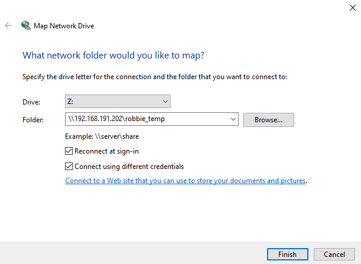

# Prerequisites

Before going through this setup you should be provided the following information  
* Zerotier network id (e.g. `a09acf0233e01009`)
* smb server/folder (e.g. `\\192.168.191.202\robbie_temp`)
* smb username and password
* if the zerotier network is private, who to contact after joining to be given access

# Zerotier setup

* note that zerotier 1.8.1 re-designed the gui. Older versions will look different than this guide.

[Download](https://www.zerotier.com/download/) and install zerotier.

After zerotier is installed/started right click the tray icon and select "Open Control Panel"  

In the control panel note that status should be "Online". If it is not that indicates a networking issue.  

Enter your network id and click join network.  

The network will now show in the UI. If the network type is public status should now be ok, otherwise you will need to complete the next step to be fully connected.  

If the network is private send your zerotier address (shown in the top left of the UI and send it to the network owner. The network owner will whitelist you on the network and the status of the network should switch to OK.  

If the following prompt appears you can typically choose either option unless you have a specific use case that needs it yes selected.  

# Mapping a network drive

Right click Network in explorer and select "Map network drive"  

Enter the server/folder provided, check "Reconnect at sign-in" and "Connect using different credentials". Press "Finish".

Enter the username and password provided, check "Remember my credentials". Press "OK".

The network drive should then show up under "This PC" like a flash drive or other removable storage.
